# 🚀 Azure Data Factory: Processo de Redundância de Arquivos ☁️💾

Repositório documentando a criação de recursos no Microsoft Azure para implementar um processo de redundância de arquivos, conforme proposto no desafio do curso **"Criando Processos de Redundância de Arquivos na Azure"**.

*   **Bootcamp:** Microsoft AI for Tech - Azure Databricks ([DIO](https://www.dio.me/))
*   **Instrutora:** [Carol Lavecchia](https://www.linkedin.com/in/caroline-lavecchia/) 👩‍🏫

 

## 📑 Índice

*   [✨ Sobre o Projeto](#-sobre-o-projeto)
*   [🛠️ Tecnologias Utilizadas](#-tecnologias-utilizadas)
*   [🚀 Etapas do Projeto](#-etapas-do-projeto)
*   [✅ Resultado](#-resultado)

 

## ✨ Sobre o Projeto

O objetivo deste projeto é demonstrar de forma prática a configuração de serviços essenciais no Azure para construir um pipeline de cópia de dados. Configuramos um **Azure Data Factory** para orquestrar a movimentação de dados de um **Azure SQL Database** para um **Azure Data Lake Storage Gen2**, garantindo uma cópia segura dos dados na camada `prata` do nosso Data Lake.

 

## 🛠️ Tecnologias Utilizadas

As seguintes ferramentas e serviços do Azure foram utilizados:

*   **Microsoft Azure Portal:** Interface para gerenciamento dos recursos.
*   **Azure Data Factory (ADF) v2:** Serviço de orquestração ETL/ELT na nuvem.
*   **Azure SQL Database:** Banco de dados relacional como serviço (PaaS) - Fonte dos dados.
*   **Azure Storage Account (Data Lake Storage Gen2):** Armazenamento escalável e otimizado para análise - Destino dos dados.

 

## 🚀 Etapas do Projeto

A seguir, detalhamos as etapas cruciais para a construção da nossa solução de redundância de dados no Azure:

### 1. Criação do Azure Data Factory (ADF) 🏭

Provisionamos a instância do ADF, que será responsável por orquestrar nosso fluxo de dados.

  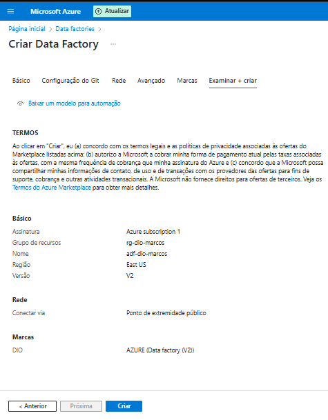

### 2. Configuração do Banco de Dados SQL Azure 💾

Criamos e configuramos o banco de dados SQL que servirá como nossa fonte de dados original.

  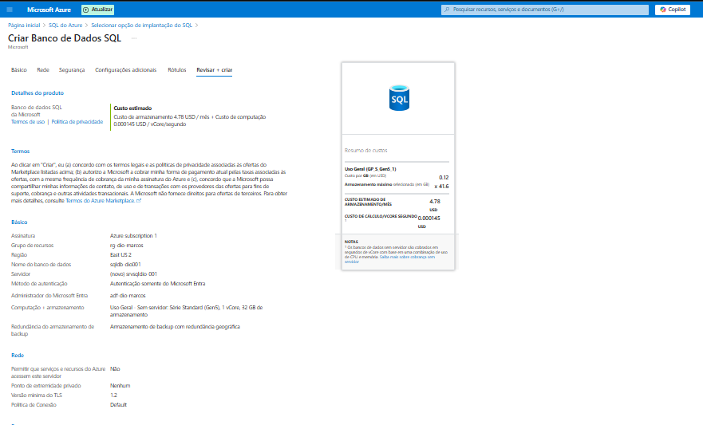

  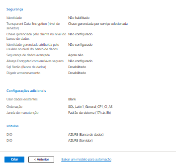

### 3. Provisionamento da Conta de Armazenamento (Storage Account) 📦

Configuramos a Conta de Armazenamento com Data Lake Storage Gen2 habilitado, definindo opções de redundância e segurança. Este será o nosso destino.

  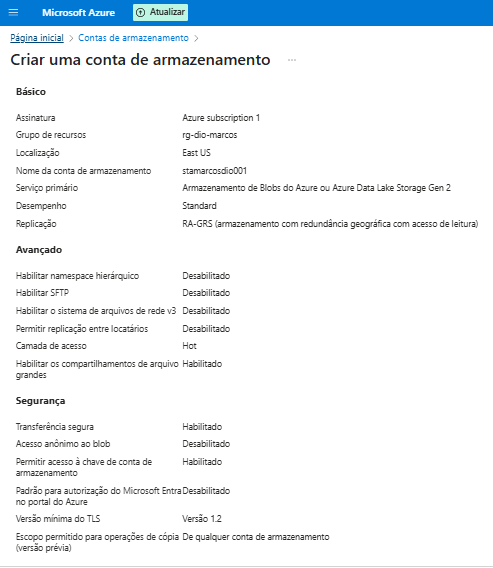

  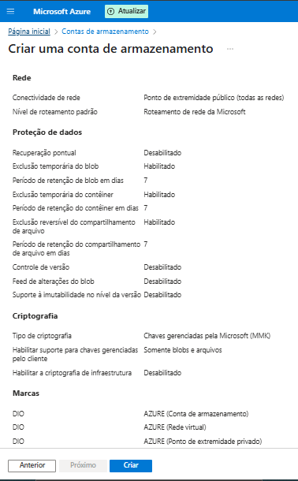

### 4. Criação dos Contêineres no Storage Account 🗂️

Organizamos nosso Data Lake criando contêineres (pastas) como `bronze`, `prata`, `ouro` e `logs`.

  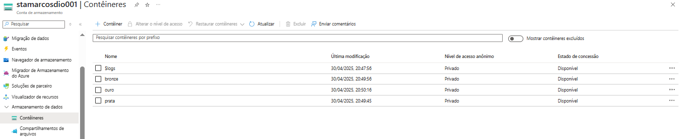

### 5. Configuração do Integration Runtime (IR) 🔌

Utilizamos o `AutoResolveIntegrationRuntime` padrão do Azure para conectividade na nuvem.

  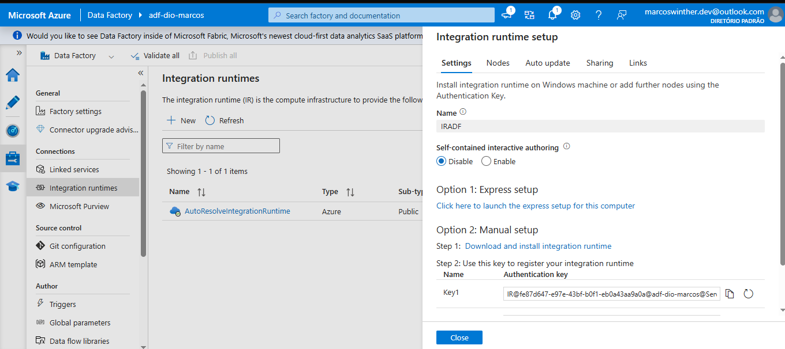

### 6. Configuração dos Linked Services 🔗

Definimos as conexões (Linked Services) no ADF para o nosso Banco de Dados SQL (fonte) e para o Data Lake Storage Gen2 (destino).

  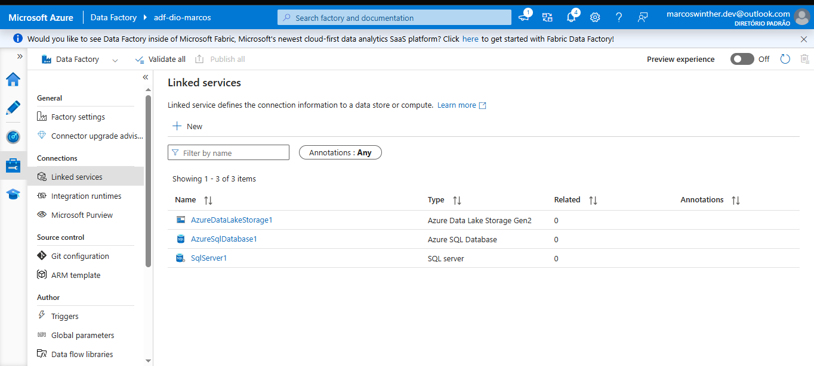

### 7. Construção do Pipeline de Cópia ⚙️➡️📄

Criamos o pipeline no ADF com uma atividade `Copy data` configurada para:
*   Ler dados da tabela especificada no Azure SQL Database (Source).
*   Gravar os dados como um arquivo de texto delimitado no contêiner `prata` do Data Lake (Sink).

  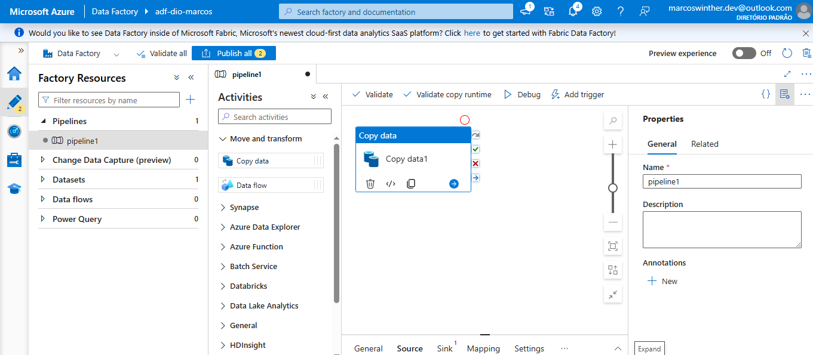

  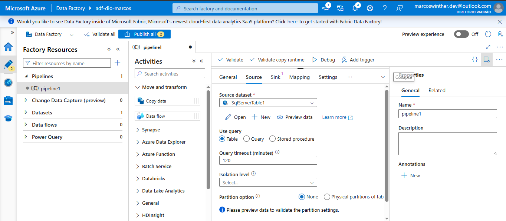

  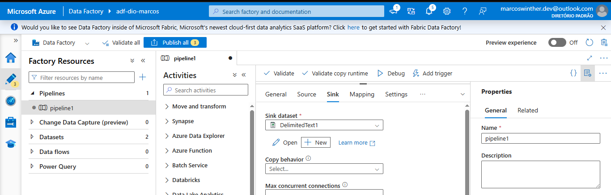

 

## ✅ Resultado

Após a configuração completa do pipeline, realizamos um teste de execução (`Debug`). A execução foi bem-sucedida 🎉, confirmando que a atividade de cópia leu os dados do Azure SQL Database e criou um novo arquivo correspondente no contêiner `prata` do Azure Data Lake Storage Gen2. Com isso, alcançamos o objetivo de criar uma redundância básica dos dados da fonte no Data Lake.

 

## 👨‍💻 Expert

    
    
&nbsp&nbsp&nbspMarcos Winther 
    &nbsp&nbsp&nbsp
    <a href="https://github.com/MarcosWinther">
    GitHub</a>&nbsp;|&nbsp;
    <a href="https://www.linkedin.com/in/marcoswinthersilva/">LinkedIn</a>
    

  

---

⌨️ com 💜 por [Marcos Winther](https://github.com/MarcosWinther)